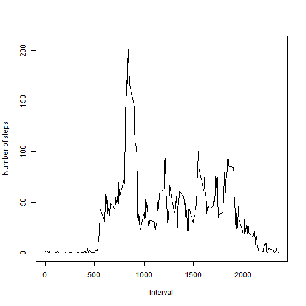
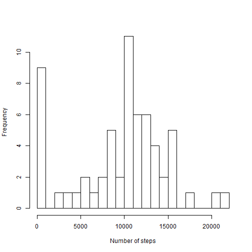
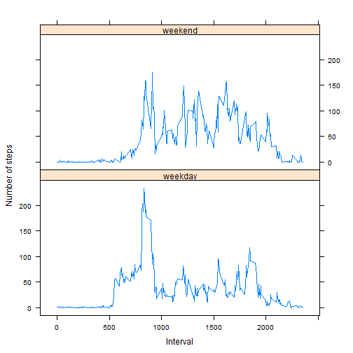

# Reproducible Research: Peer Assessment 1
  
## Loading and preprocessing the data
<br>
Data is loaded and preprocessed.

```r
activity <- read.csv("./data/activity.csv")
activity$date <- as.Date(activity$date, "%Y-%m-%d")
```

<br>
## What is mean total number of steps taken per day?

The histogram of the total number of steps taken per day.

```r
activity_dailytotal <- aggregate(activity[, c("steps"), drop = FALSE], list(date = activity$date), 
    sum, na.rm = TRUE)
hist(activity_dailytotal$steps, breaks = 20, main = "", xlab = "Number of steps", 
    ylab = "Frequency")
```

 

```r
activity_dailytotalmean <- mean(activity_dailytotal$steps)
activity_dailytotalmedian <- median(activity_dailytotal$steps)
```

The mean and median total number of steps taken per day are 9354.23 and 10395 respectively.
<br>
## What is the average daily activity pattern?
<br/>
Plot of the average number of steps taken across all days by the 5-minute interval.

```r
activity_intervalmean <- aggregate(activity[, c("steps"), drop = FALSE], list(interval = activity$interval), 
    mean, na.rm = TRUE)
plot(activity_intervalmean$interval, activity_intervalmean$steps, type = "l", 
    main = "", xlab = "Interval", ylab = "Number of steps")
```

 

```r
activity_maxintervalmean <- activity_intervalmean[activity_intervalmean$steps == 
    max(activity_intervalmean$steps), 1]
```

<br>
The maximum number of steps, 206.17, occurs in the 5-minute interval that begins at 08:35.
## Imputing missing values
<br>
Calculate the number of missing values

```r
activity_countofnasteps <- sum(is.na(activity$steps))
```

There are 2304 missing steps values across a number of days/intervals.
<br>
Histogram of the total number of steps taken per day using the **imputed** data.

```r
activity_imputed <- activity
activity_imputed$steps <- ifelse(is.na(activity_imputed$steps), activity_intervalmean[activity_intervalmean$interval == 
    activity$interval, 2], activity$steps)
activity_dailytotal_imputed <- aggregate(activity_imputed[, c("steps"), drop = FALSE], 
    list(date = activity$date), sum, na.rm = TRUE)
hist(activity_dailytotal_imputed$steps, breaks = 20, main = "", xlab = "Number of steps", 
    ylab = "Frequency")
```

 

```r
activity_dailytotalmean_imputed <- mean(activity_dailytotal_imputed$steps)
activity_dailytotalmedian_imputed <- as.integer(median(activity_dailytotal_imputed$steps))
```

The mean and median total number of steps taken per day are 9530.72 and 10439 respectively.
<br>
## Are there differences in activity patterns between weekdays and weekends?
<br>
A series of plot that contains a time series plots of the 5-minute interval and the average number of steps taken across all weekday days or weekend days using the **imputed** data.

```r
activity_imputed$weekdays <- weekdays(activity_imputed$date)
activity_imputed$weekday <- as.factor(ifelse(activity_imputed$weekdays %in% 
    c("Saturday", "Sunday"), "weekend", "weekday"))
activity_intervalmean_imputed <- aggregate(activity_imputed[, c("steps"), drop = FALSE], 
    list(interval = activity_imputed$interval, weekday = activity_imputed$weekday), 
    mean, na.rm = TRUE)
library(lattice)
p <- xyplot(steps ~ interval | weekday, data = activity_intervalmean_imputed, 
    type = "l", layout = c(1, 2), main = "", xlab = "Interval", ylab = "Number of steps")
print(p)
```

 

